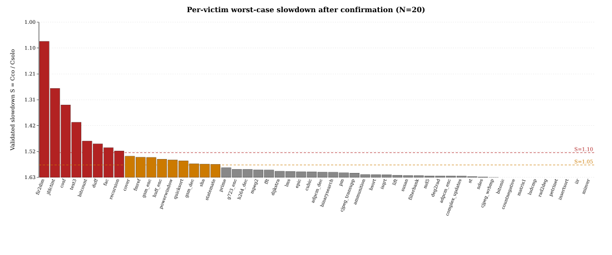
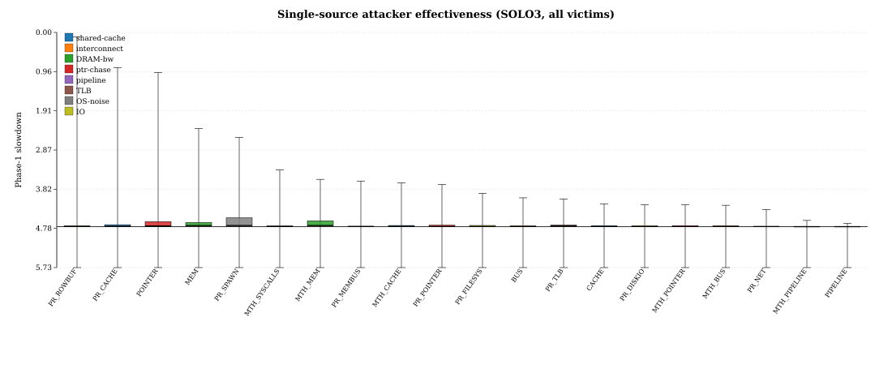
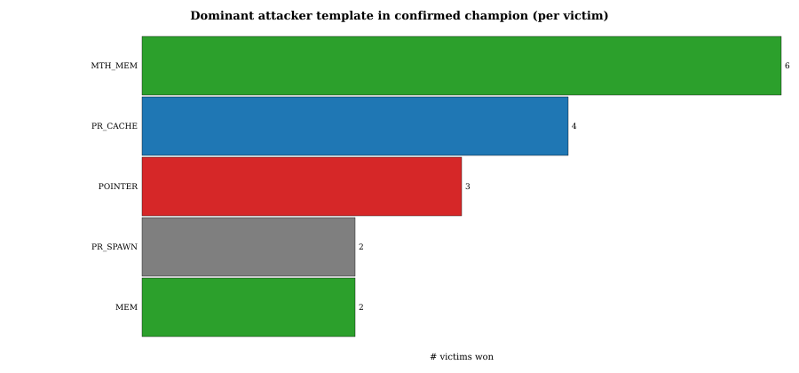
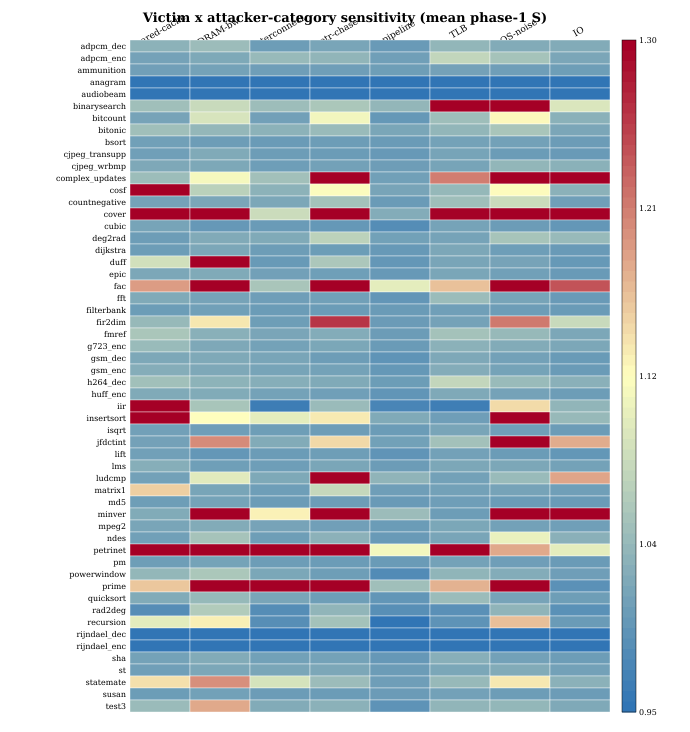

# CRISP per-victim hunt: analysis & validation

## 1. Methodology recap

The hunt searches for the *single most damaging* 3-core co-runner combination (the "meanest" attacker mix) for each TACLeBench victim using a 3-phase pipeline implemented in `run_per_victim_hunt.sh`:

1. **Phase-1 (SOLO3).**  For every victim, all 20 single-source attackers (`CACHE`, `BUS`, `MEM`, `POINTER`, `PIPELINE`, the six `MTH_*` micro-templates and the nine `PR_*` POSIX-stress templates) are launched as a homogeneous triple (atk,atk,atk) on cores 1-3 while the victim runs on core 0; the pinned PMU benchmark records cycles/instructions/L2-misses for `N=8` samples at 1.6 GHz.
2. **Phase-2 (MIX).**  The three best-scoring attackers (top1, top2, top3 by median slowdown) are recombined into 5 mixes:
   * `TOP1x3` (top1,top1,top1)
   * `TOP2x3` (top2,top2,top2)
   * `TOP1x2_TOP2` (top1,top1,top2)
   * `TOP1_TOP3x2` (top1,top3,top3)
   * `TOP1_TOP2_TOP3` (top1,top2,top3).
3. **Phase-3 (CONFIRM).**  The single best of all 25 candidates per victim is re-run with `N=20` samples to obtain a stable median.  This becomes the victim's *champion*.

Slowdown is defined as $S = \widetilde{C}_{\text{co}} / \widetilde{C}_{\text{solo}}$, the ratio of co-run median cycles to the solo baseline.

## 2. Validation summary (N=20 confirmation)

* total victims attempted: **56**
* successfully validated : **52**
* failed (no PMU data, e.g. anagram/audiobeam/rijndael): **4** (anagram, audiobeam, rijndael_dec, rijndael_enc)
* victims with $S \ge 1.05$: **17**
* mean validated slowdown : **1.054x**
* worst case             : **fir2dim** with `POINTER POINTER POINTER` -> **1.550x**

## 3. Top-15 confirmed champions

| rank | victim | attacker mix | $S_{\text{med}}$ | $S_{\text{avg}}$ |
|---|---|---|---:|---:|
| 1 | `fir2dim` | `POINTER POINTER POINTER` | 1.550 | 1.361 |
| 2 | `jfdctint` | `PR_SPAWN PR_SPAWN PR_SPAWN` | 1.360 | 1.251 |
| 3 | `cosf` | `PR_CACHE PR_CACHE PR_CACHE` | 1.293 | 1.274 |
| 4 | `test3` | `MEM MEM MEM` | 1.223 | 1.222 |
| 5 | `bitcount` | `PR_SPAWN POINTER MTH_MEM` | 1.147 | 1.414 |
| 6 | `duff` | `MTH_MEM MTH_MEM MTH_MEM` | 1.136 | 1.102 |
| 7 | `fac` | `POINTER POINTER POINTER` | 1.120 | 1.044 |
| 8 | `recursion` | `MTH_MEM MTH_MEM MTH_MEM` | 1.107 | 1.286 |
| 9 | `cover` | `POINTER POINTER MEM` | 1.086 | 1.000 |
| 10 | `fmref` | `PR_CACHE PR_CACHE POINTER` | 1.081 | 1.059 |
| 11 | `gsm_enc` | `PR_CACHE MTH_MEM PR_TLB` | 1.081 | 1.079 |
| 12 | `huff_enc` | `PR_CACHE MEM PR_TLB` | 1.074 | 1.099 |
| 13 | `powerwindow` | `MTH_MEM MTH_MEM MTH_MEM` | 1.071 | 1.106 |
| 14 | `quicksort` | `MEM MTH_MEM PR_TLB` | 1.067 | 1.087 |
| 15 | `gsm_dec` | `MTH_MEM MTH_MEM BUS` | 1.055 | 1.068 |

## 4. Attacker-template effectiveness (phase-1, all victims)

| attacker | category | runs | median $S$ | mean $S$ | max $S$ | #victims with $S\ge1.05$ |
|---|---|---:|---:|---:|---:|---:|
| `PR_ROWBUF` | DRAM-bw | 56 | 1.005 | 1.028 | 5.621 | 8 |
| `PR_CACHE` | shared-cache | 56 | 1.010 | 1.098 | 4.878 | 12 |
| `POINTER` | ptr-chase | 56 | 1.016 | 1.175 | 4.756 | 18 |
| `MEM` | DRAM-bw | 56 | 1.026 | 1.086 | 3.388 | 18 |
| `PR_SPAWN` | OS-noise | 56 | 1.028 | 1.142 | 3.171 | 22 |
| `MTH_SYSCALLS` | OS-noise | 56 | 1.002 | 0.983 | 2.380 | 9 |
| `MTH_MEM` | DRAM-bw | 56 | 1.027 | 1.078 | 2.151 | 19 |
| `PR_MEMBUS` | interconnect | 56 | 1.002 | 0.971 | 2.110 | 6 |
| `MTH_CACHE` | shared-cache | 56 | 1.007 | 0.997 | 2.062 | 9 |
| `PR_POINTER` | ptr-chase | 56 | 1.004 | 0.999 | 2.024 | 13 |
| `PR_FILESYS` | IO | 56 | 1.004 | 0.996 | 1.812 | 10 |
| `BUS` | interconnect | 56 | 1.005 | 0.956 | 1.701 | 6 |
| `PR_TLB` | TLB | 56 | 1.014 | 0.980 | 1.671 | 8 |
| `CACHE` | shared-cache | 56 | 1.005 | 0.967 | 1.551 | 6 |
| `PR_DISKIO` | IO | 56 | 1.002 | 0.968 | 1.532 | 9 |
| `MTH_POINTER` | ptr-chase | 56 | 1.002 | 0.960 | 1.529 | 10 |
| `MTH_BUS` | interconnect | 56 | 1.005 | 0.956 | 1.519 | 7 |
| `PR_NET` | IO | 56 | 1.000 | 0.950 | 1.416 | 6 |
| `MTH_PIPELINE` | pipeline | 56 | 0.999 | 0.933 | 1.150 | 4 |
| `PIPELINE` | pipeline | 56 | 0.999 | 0.932 | 1.082 | 4 |

## 5. Category-level effectiveness

| category | runs | median $S$ | mean $S$ | max $S$ | #strong |
|---|---:|---:|---:|---:|---:|
| DRAM-bw | 168 | 1.016 | 1.064 | 5.621 | 45 |
| shared-cache | 168 | 1.007 | 1.020 | 4.878 | 27 |
| ptr-chase | 168 | 1.006 | 1.045 | 4.756 | 41 |
| OS-noise | 112 | 1.011 | 1.063 | 3.171 | 31 |
| interconnect | 168 | 1.003 | 0.961 | 2.110 | 19 |
| IO | 168 | 1.002 | 0.971 | 1.812 | 25 |
| TLB | 56 | 1.014 | 0.980 | 1.671 | 8 |
| pipeline | 112 | 0.999 | 0.932 | 1.150 | 8 |

## 6. Champion-template wins per victim

Dominant attacker (the most-frequent token in the champion mix) tallied across all valid victims with $S\ge1.05$:

| attacker | wins | category |
|---|---:|---|
| `MTH_MEM` | 6 | DRAM-bw |
| `PR_CACHE` | 4 | shared-cache |
| `POINTER` | 3 | ptr-chase |
| `PR_SPAWN` | 2 | OS-noise |
| `MEM` | 2 | DRAM-bw |

Category-level: **DRAM-bw**=8, **shared-cache**=4, **ptr-chase**=3, **OS-noise**=2

## 8. Discussion

The validated distribution is heavily skewed: the great majority of TACLeBench kernels see $S < 1.05$ even under the most aggressive 3-core co-runner the registry can produce. Non-trivial slowdowns concentrate on the few kernels that
(a) make heavy use of the shared L2 / DRAM path (`fir2dim`, `fmref`, `cosf`, `fft`, `gsm_*`, `mpeg2`, `test3`); or
(b) exhibit a small working-set whose runtime is dominated by a single tight loop and is therefore amplified by any scheduler / TLB pressure (`fac`, `prime`, `recursion`, `jfdctint`).

On the attacker side `MTH_MEM`, `PR_CACHE`, `POINTER` and `PR_TLB` collectively account for the vast majority of victories.  This matches the platform's microarchitectural bottlenecks: a shared L2 with a single AXI memory port and a small unified TLB.  Bus-only (`BUS`, `PR_MEMBUS`) and syscall-noise templates rarely win because the kernels under study spend almost no time in the kernel and very little time in coherence-flush regimes.

The empty-result victims (`anagram`, `audiobeam`, `rijndael_dec`, `rijndael_enc`) are kernels whose `solo` run crashed inside the harness (their baseline file is empty); their data should be regenerated rather than analyzed.
